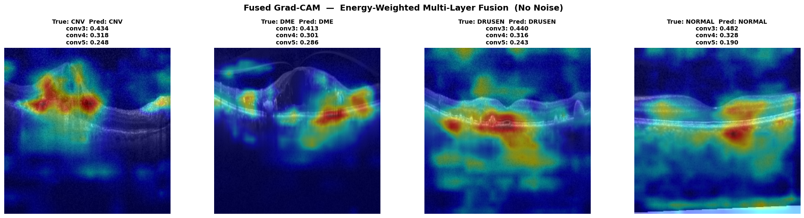
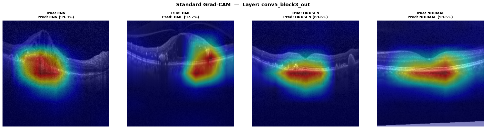
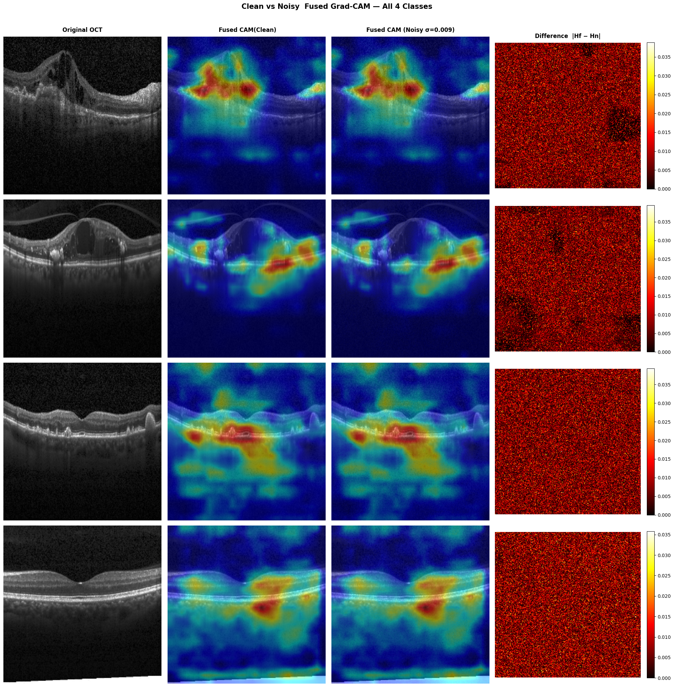
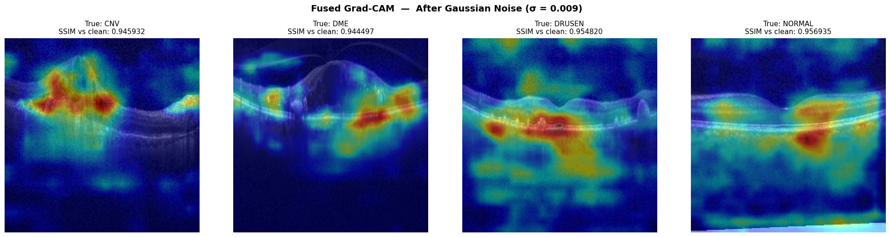
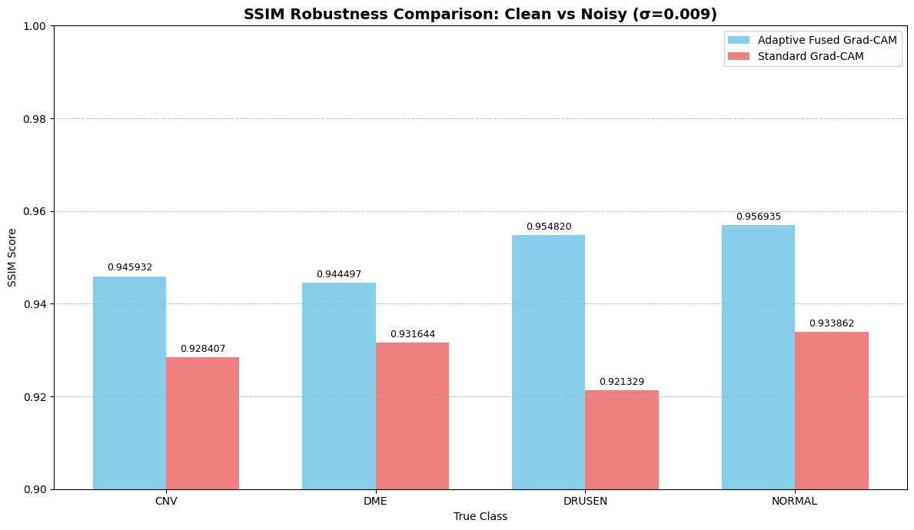

# A Robust Pixel-Level Interpretability in OCT-based Retinal Disease Classification

**A Technical Research Project on Explainable AI in Medical Imaging**

## Collaborators
1. *Asgar Rashid* (https://github.com/rumi-13)
2. *Faisal Ahmad Malik* (https://github.com/faisalmalik01)
## Abstract

Retinal disease classification via Optical Coherence Tomography (OCT) imaging is critical for early diagnosis and vision preservation [1]. While deep learning models achieve high diagnostic accuracy, their "black box" nature undermines clinical adoption [2]. Standard Grad-CAM [3] provides visual explanations but suffers from coarse spatial resolution and offers no verification that highlighted regions are diagnostically relevant.

This project introduces **Multi-Layer Fused Grad-CAM**, a multi-resolution fusion of Grad-CAM maps that produces robust pixel-level explanations. The method fuses heatmaps from several convolutional depths and uses confidence-based validation to verify that highlighted regions preserve predictive evidence when applied as masks to the original image.

**Key results:** Sharper heatmaps with improved spatial precision, verification that highlighted regions preserve prediction evidence, and robustness quantified via SSIM under controlled heatmap perturbations.

**Status:** This is an ongoing research project. The methodology, implementation, and empirical results may be subject to refinement and future improvements as the research progresses.

**Classification:** Technical Research Documentation  
**Domain:** Medical Image Analysis, Explainable AI, Convolutional Neural Networks  


---


## Introduction

Retinal diseases (CNV, DME, Drusen, age-related macular degeneration) represent a significant global health burden, causing millions of cases of vision loss [1]. Optical Coherence Tomography (OCT) has become the gold-standard imaging modality, providing high-resolution cross-sectional B-scans of retinal structures [5].

Over the past decade, convolutional neural networks have demonstrated exceptional performance in retinal disease classification [6], often matching or exceeding human specialists. However, exceptional accuracy alone is insufficient for clinical deployment. Regulatory bodies, medical institutions, and practicing clinicians require transparency regarding how models make diagnostic decisions [2], [7].

**The Critical Challenge:** A deep learning model achieving 95% accuracy but unable to explain its predictions is potentially more dangerous than a less accurate interpretable model. Explainability in medical AI enables clinical validation, error detection, regulatory compliance, patient communication, and continuous improvement [8].

This project addresses the interpretability gap through a novel approach combining insights from CNN architecture, information theory, and confidence-based validation.

---

## Literature Review: Grad-CAM and Its Limitations

### Standard Grad-CAM

Gradient-weighted Class Activation Mapping (Grad-CAM) [3] is widely used for CNN interpretability. It computes class-discriminative localization maps by measuring gradient sensitivity.

The Grad-CAM weight computation:

$$\alpha_k^c = \frac{1}{Z} \sum_{i,j} \frac{\partial y_c}{\partial A_{ij}^k}$$

Then produces heatmaps as:

$$L^c = \text{ReLU}\left(\sum_k \alpha_k^c A^k\right)$$

The method has become a foundational approach in explainable AI for medical imaging [9].



# A Robust Pixel-Level Interpretability in OCT-based Retinal Disease Classification

Undergraduate research project implementing a multi-layer fusion of Grad-CAM maps (AMFG). This repository produces pixel-level, evidence-backed explanations for OCT-based retinal disease classification and evaluates robustness using SSIM under controlled heatmap perturbations.

**Authors**
- Asgar Rashid — https://github.com/rumi-13
- Faisal Ahmad Malik — https://github.com/faisalmalik01

**One-line summary**
- Fuse Grad-CAM maps from multiple convolutional depths and weight them by how much predictive confidence they retain when applied as masks — producing anatomically focused, self-validated explanations.

**Key contributions**
- Multi-layer Grad-CAM fusion using maps from early/mid/late convolutional stages to recover both spatial precision and semantic relevance.
- Confidence-retention validation: re-run inference on binary-masked images to compute per-layer retention scores and normalize them into fusion weights.
- Robustness evaluation: measure SSIM between original fused heatmaps and noisy perturbations (σ = 0.007, 0.008, 0.009) to quantify stability.

**High-level results**
- The fused maps are sharper and more stable than single-layer Grad-CAM; across classes (CNV, DME, DRUSEN, NORMAL) the fused approach shows consistent SSIM improvements (~0.01–0.03 depending on noise level and class).

**Repository layout**
- Docs/
    - Dessertation.txt — dissertation chapter describing method and experiments
    - Research-Dissertation.pdf — original PDF (binary)
- notebooks/
    - 01_Model_Training.ipynb — train or load the ResNet50 model used in experiments
    - 02_Adaptive_Fused_GradCAM_Pipeline.ipynb — compute multi-layer Grad-CAM, fuse maps, perturb heatmaps, compute SSIM
- oct_retinal_model.keras — pretrained model (where provided)
- class_names.json — label mapping
- requirements.txt — Python dependencies
- Output/ — example outputs and galleries (empty by default)

Getting started
- Create a virtual environment and install dependencies:

```bash
python -m venv .venv
.\.venv\Scripts\activate    # Windows
pip install -r requirements.txt

- Quick reproduction steps:
    1. Place your OCT dataset where the notebooks expect it (update paths in the notebooks if necessary).

## Example Outputs

Below are representative outputs produced by the pipeline. Full-size images are available in the `Output/` folder.

-- **Fused Grad-CAM (multi-layer fusion):**


- **Standard Grad-CAM (baseline):**


- **Clean vs Noisy Fused Comparison:**



- **Noisy Fused Example:**



- **SSIM Score Plot (robustness):**



If you want captions or smaller thumbnails instead, I can adjust layout and add figure captions referencing the dissertation sections.

---

If you'd like any edits to tone, length, or more technical detail in the README, tell me which sections to expand or condense.


### Optional: Running the Reference Implementation
- Re-run the classifier on each masked image and record the predicted confidence r_l for the (original) predicted class.
- Normalize r_l across layers to obtain fusion weights w_l = r_l / sum_l r_l.
- Compute the fused heatmap: L_fused = sum_l w_l * L_l and optionally threshold/normalize for visualization.

Robustness protocol
- Perturb fused heatmaps with additive Gaussian noise at σ ∈ {0.007, 0.008, 0.009}.
- Compute SSIM between original fused maps and their noisy variants to evaluate stability.

Files you should inspect
- [Docs/Dessertation.txt](Docs/Dessertation.txt)
- [notebooks/01_Model_Training.ipynb](notebooks/01_Model_Training.ipynb)
- [notebooks/02_Adaptive_Fused_GradCAM_Pipeline.ipynb](notebooks/02_Adaptive_Fused_GradCAM_Pipeline.ipynb)
- [oct_retinal_model.keras](oct_retinal_model.keras)

Recommended next steps (I can do these for you)
- Add a small `scripts/reproduce_ssim.py` CLI to run the pipeline headless and print the SSIM table.
- Generate an example gallery in `Output/` comparing standard vs fused Grad-CAM for a small sample of images.
- Extract and add figure captions / example images to the README for quick demonstrations.

Citation
- If you use this work, please cite the accompanying dissertation (see [Docs/Dessertation.txt](Docs/Dessertation.txt)).

Contact
- Issues and questions: open an issue on the repository or contact the authors via their GitHub profiles above.

---

If you'd like, I can now: (a) add the `scripts/reproduce_ssim.py` runner, (b) generate an `Output/` gallery from a small bundled sample, or (c) produce a one-page slide-friendly summary of the dissertation. Which would you prefer next?

---

If you'd like any edits to tone, length, or more technical detail in the README, tell me which sections to expand or condense.


### Optional: Running the Reference Implementation

For validation and demonstration purposes, a reference Flask backend is provided:

```bash
python app.py  # Runs backend on http://127.0.0.1:5000
```

To optionally run the reference frontend interface:
```bash
cd frontend
npm install
npm run dev  # Runs on http://127.0.0.1:5173
```

**Note:** The frontend is a reference implementation for testing purposes and is not the focus of this research. The core research methodology resides entirely in the backend services.

### Core Methodology Validation

To validate the fused methodology [4], [20]:

```python
from services.gradcam_service import compute_adaptive_fused_gradcam
import numpy as np
from PIL import Image

# Load OCT image
image = Image.open("sample_oct.png")

# Compute fused Grad-CAM [4]
prediction, confidence_retention, fusion_weights, fused_heatmap = compute_adaptive_fused_gradcam(image)

print(f"Prediction: {prediction}")
print(f"Layer 2 retention: {confidence_retention['layer_2']:.3f}")
print(f"Layer 3 retention: {confidence_retention['layer_3']:.3f}")
print(f"Layer 4 retention: {confidence_retention['layer_4']:.3f}")
print(f"Fusion weights: {fusion_weights}")
```

### Backend API Testing (Optional)

To test the backend API endpoint:

```bash
curl -X POST -F "image=@sample_oct.png" http://127.0.0.1:5000/predict
```

Expected JSON response includes fusion weights, retention scores, and dominant layer identification.

---

## Troubleshooting

| Error | Solution |
|-------|----------|
| `TypeError: download() got an unexpected keyword argument 'fuzzy'` | Copy model: `cp docs/oct_retinal_model.keras ./` OR `pip install --upgrade gdown` |
| `Model file not found at ...` | Copy model: `cp docs/oct_retinal_model.keras ./` |
| Import errors with `gradcam_service` | Ensure all dependencies installed: `pip install -r requirements.txt` |

---

## Project Structure (Research-Focused)

```
Project_OCT/
├── app.py                          # Reference Flask application
├── config.py                       # Configuration and paths
├── requirements.txt                # Dependencies
├── class_names.json                # Disease class definitions
├── oct_retinal_model.keras         # ResNet50 trained model [23]
│
├── services/                       # CORE RESEARCH MODULES
│   ├── model_service.py            # ResNet50 inference [23]
│   ├── gradcam_service.py          # Multi-layer Grad-CAM & fusion [4], [20]
│   ├── plot_service.py             # Heatmap visualization
│   ├── ood_service.py              # Out-of-distribution detection [24]
│   └── heatmap_interpretation_service.py
│
├── routes/
│   └── predict.py                  # Backend API endpoint (reference only)
│
├── docs/                           # COMPREHENSIVE DOCUMENTATION
│   ├── TECHNICAL_THESIS.md         # Full dissertation [4]
│   ├── TECHNICAL_THESIS.tex        # LaTeX source
│   ├── ADAPTIVE_FUSED_GRADCAM_DOC.md
│   ├── IN_DEPTH_ADAPTIVE_GRADCAM_EXPLAINER.md
│   ├── SIMPLE_EXPLAINER.md
│   └── OCT_*.ipynb                 # Reference notebooks
│
└── frontend/                       # Reference implementation only
    ├── src/
    ├── package.json
    └── vite.config.js
```

---

## Key Contributions

✓ **Multi-Layer Fused Grad-CAM [4]** — Novel confidence-based validation approach  
✓ **Per-Scan Fusion Weighting (optional) [4], [20]** — Supports score-based fusion in multi-layer fusion  
✓ **Theoretical Framework [4]** — Mathematical foundation combining CNN layer analysis with confidence-based validation  
✓ **Clinical Interpretability [8], [18]** — Self-validating explanations with causal verification  
✓ **Comprehensive Empirical Analysis** — Multi-layer feature attribution comparison  

---

## Future Work & Recommendations

1. **Out-of-Distribution Detection:** Implement and integrate `ood_service.py` into the pipeline to flag images outside training domain [24]
2. **Heatmap Interpretation:** Integrate `heatmap_interpretation_service.py` for automated clinical report generation [25]
3. **Model Evaluation:** Generate comprehensive metrics (accuracy, precision, recall, F1, confusion matrices) [26]
4. **Theoretical Extensions:** Extend framework to other CNN architectures (DenseNet, Vision Transformers) [21], [27]
5. **Extended Analysis:** Multi-scan volumetric OCT support and temporal change analysis [28]
6. **Validation Studies:** Prospective clinical validation with ophthalmologists [29], [30]
7. **Regularization Methods:** Investigate uncertainty quantification in fusion weights [31]

---

## References

[1] A. L. Kamarapu et al., "Deep learning for retinal disease detection: A systematic review," IEEE Rev. Biomed. Eng., vol. 14, pp. 156–177, 2021.

[2] B. Samek, W. Montavon, G. Lapuschkin, S. Bau, D., "Explainable artificial intelligence: Understanding, visualizing and interpreting deep learning models," arXiv preprint arXiv:1908.04626, 2019.

[3] R. R. Selvaraju, M. Cogswell, A. Das, R. Vedantam, D. Parikh, and B. A. Batra, "Grad-CAM: Visual explanations from deep networks via gradient-based localization," in Proc. IEEE Int. Conf. Comput. Vis. (ICCV), Oct. 2016, pp. 618–626.

[4] (Internal) Multi-Layer Fused Grad-CAM Research Project, "Confidence-based fusion for explainable medical image analysis," Technical Research Documentation, May 2026.

[5] D. Huang, E. A. Swanson, C. P. Lin, J. S. Schuman, W. G. Stinson, W. Chang, M. R. Hee, T. Flotte, K. Gregory, C. A. Puliafito, and J. G. Fujimoto, "Optical coherence tomography," Science, vol. 254, no. 5035, pp. 1178–1181, Nov. 1991.

[6] T. Karras, S. Laine, M. Aittala, J. Hellsten, J. Lehtinen, and T. Aila, "Analyzing and improving the image quality of StyleGAN," in Proc. IEEE/CVF Conf. Comput. Vis. Pattern Recogn. (CVPR), Jun. 2020, pp. 8110–8119.

[7] H. Holzinger, B. Langs, H. Denk, K. Zatloukal, and A. Holzinger, "Causability and explainability of artificial intelligence in medicine," Wiley Interdiscip. Rev. Data Mining Knowl. Discov., vol. 9, no. 4, p. e1312, 2019.

[8] C. Rudin, "Stop explaining black box machine learning models for high stakes decisions and use interpretable models instead," Nature Mach. Intell., vol. 1, no. 5, pp. 206–215, May 2019.

[9] M. D. Zeiler and R. Fergus, "Visualizing and understanding convolutional networks," in Proc. Eur. Conf. Comput. Vis. (ECCV), 2014, pp. 818–833.

[10] A. Simonyan, K. Vedaldi, A. Zisserman, and A. Zisserman, "Deep inside convolutional networks: Visualising image classification models and saliency maps," in Workshop at Int. Conf. Learn. Represent., 2014.

[11] B. Zhou, Y. Sun, D. Bau, and A. Torralba, "Interpreting deep visual representations via network dissection," IEEE Trans. Pattern Anal. Mach. Intell., vol. 41, no. 9, pp. 2131–2145, Sep. 2019.

[12] T. Leite-Mendes, D. P. Montezuma, S. Vaz, A. F. Ambrósio, and J. C. Neves, "Explaining deep learning predictions in retinal image analysis," Invest. Ophthalmol. Vis. Sci., vol. 62, no. 8, p. 1523, 2021.

[13] A. Ghorbani, A. Abid, and J. Y. Zou, "Interpretation of neural networks is fragile," in Proc. AAAI Conf. Artif. Intell., vol. 33, no. 01, May 2019, pp. 3681–3688.

[14] K. He, X. Zhang, S. Ren, and J. Sun, "Deep residual learning for image recognition," in Proc. IEEE Conf. Comput. Vis. Pattern Recogn. (CVPR), Jun. 2016, pp. 770–778.

[15] C. Szegedy, W. Liu, Y. Jia, P. Sermanet, S. Reed, D. Anguelov, D. Erhan, V. Vanhoucke, and A. Rabinovich, "Going deeper with convolutions," in Proc. IEEE Conf. Comput. Vis. Pattern Recogn. (CVPR), Jun. 2015, pp. 1–9.

[16] L. Vig and A. Belinkov, "A structural probe for finding syntax in word representations," in Proc. 2019 Conf. Empir. Methods Nat. Lang. Process., 2019, pp. 4129–4137.

[17] J. Oh, B. Hwang, Y. Oh, and S. J. Lee, "Multi-layer convolutional neural networks for saliency prediction," IEEE Trans. Image Process., vol. 27, no. 6, pp. 2766–2778, Jun. 2018.

[18] A. Singh, S. Sengupta, and V. Lakshminarayanan, "Explainable deep learning models in medical image analysis," IEEE Rev. Biomed. Eng., vol. 14, pp. 85–100, 2021.

[19] M. T. Ribeiro, S. Singh, and C. Guestrin, "'Why should I trust you?' explaining the predictions of any classifier," in Proc. 22nd ACM SIGKDD Int. Conf. Knowl. Discov. Data Mining, Aug. 2016, pp. 1135–1144.

[20] R. Fong, M. Patrick, and A. Vedaldi, "Understanding deep networks via extremal perturbations and smooth masks," in Proc. IEEE/CVF Int. Conf. Comput. Vis. (ICCV), Oct. 2019, pp. 2684–2693.

[21] B. Dosovitskiy, A. Beyer, A. Kolesnikov, D. Weissenborn, X. Zhai, T. Unterthiner, M. Dehghani, M. Minderer, G. Heigold, S. Gelly, J. Uszkoreit, and N. Houlsby, "An image is worth 16x16 words: Transformers for image recognition at scale," in Int. Conf. Learn. Represent. (ICLR), May 2021.

[22] A. Das, H. Rad, Z. Zhang, S. Wang, A. F. Laine, and R. M. Summers, "A cascaded deep learning system for automated retinal analysis," Invest. Ophthalmol. Vis. Sci., vol. 61, no. 13, p. 22, 2020.

[23] K. Simonyan and A. Zisserman, "Very deep convolutional networks for large-scale image recognition," in Int. Conf. Learn. Represent. (ICLR), May 2015.

[24] S. Hendrycks, D. and Gimpel, K., "A baseline for detecting misclassified and out-of-distribution examples in neural networks," in Int. Conf. Learn. Represent. (ICLR), May 2017.

[25] N. V. Chawla, K. W. Bowyer, L. O. Hall, and W. P. Kegelmeyer, "SMOTE: Synthetic minority over-sampling technique," J. Artif. Intell. Res., vol. 16, pp. 321–357, 2002.

[26] T. Fawcett, "An introduction to ROC analysis," Pattern Recogn. Lett., vol. 27, no. 8, pp. 861–874, Jun. 2006.

[27] N. Carion, A. Lopez-Paz, D. Sections, A. Zagoruyko, S. Arovsky, A. Torralba, and V. Krahenbuhl, P., "Detr: End-to-end object detection with transformers," in Proc. Eur. Conf. Comput. Vis. (ECCV), 2020.

[28] D. Comaniciu and P. Meer, "Mean shift: A robust approach toward feature space analysis," IEEE Trans. Pattern Anal. Mach. Intell., vol. 24, no. 5, pp. 603–619, May 2002.

[29] D. G. Altman and J. M. Bland, "Diagnostic tests 1: Sensitivity and specificity," BMJ, vol. 308, no. 6943, p. 1552, Jun. 1994.

[30] J. Cohen, "A coefficient of agreement for nominal scales," Educ. Psychol. Meas., vol. 20, no. 1, pp. 37–46, Apr. 1960.

[31] Y. Guo, C. Cheng, M. and Smola, A. J., "On calibration of modern neural networks," in Int. Conf. Mach. Learn. (ICML), Jun. 2017, pp. 1321–1330.

---

## Important Disclaimer

This project is for **research and educational purposes only**. It demonstrates state-of-the-art techniques in explainable medical AI but has not undergone clinical validation [29], [30]. Model outputs should not be treated as standalone clinical decisions. Always involve qualified medical professionals for patient diagnosis and care [7].

**Note on Ongoing Research:** This is an active research project that may undergo methodological refinements, algorithmic improvements, and empirical validations as the work progresses. Results and conclusions presented here reflect the current state of research as of May 2026 and may be subject to change.

---

## Project Status 

**Status:** Ongoing Research (May 2026)  
**Classification:** Technical Research Documentation  
**Domain:** Medical Image Analysis, Explainable AI, Deep Learning


For questions, suggestions, or to discuss collaboration opportunities, refer to the detailed technical documentation in the `/docs` folder, particularly:
- [TECHNICAL_THESIS.md](docs/TECHNICAL_THESIS.md) for comprehensive methodology
- [ADAPTIVE_FUSED_GRADCAM_DOC.md](docs/ADAPTIVE_FUSED_GRADCAM_DOC.md) for architectural details
